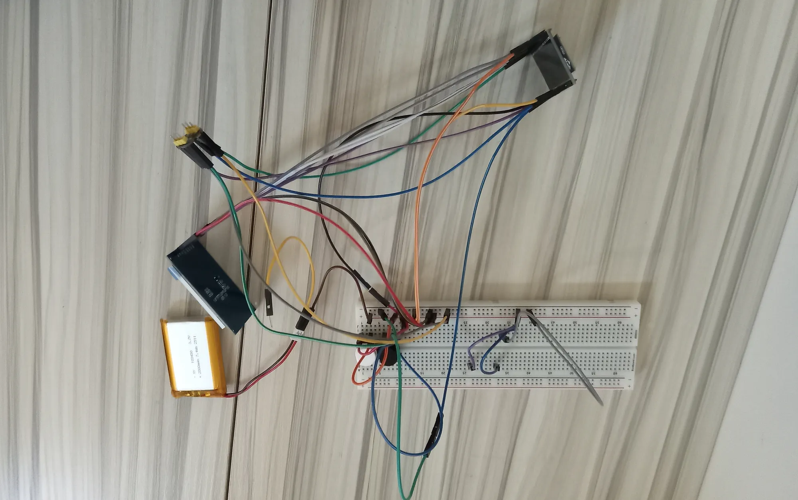

# Flappy-Bird-on-a-ESP32-Microcontroller

My first Blueprint project where I'm learning how to wire components and code the original Flappy Bird game, and Flappy Dunk (a variation of Flappy Bird seen on 10,000 offline games mobile app) on a ESP32 microcontroller using the Arduino IDE.

To use my project, look at the BOM and KiCAD schematic and buy and wire the components on a breadboard, (or PCB if you're crazy). Then, connect a USB cable  from your ESP32 to your computer, copy and paste my sketch in Arduino IDE and upload sketch to arduino. Then, enjoy the 2 Flappy Bird games! I let some of friends play the finished games, and they said it was really cool!

I wanted to put my theory electronics knowledge of some components to the test of making retro games. I loved playing arcade games when I was young, as they were my source of enterainment at the time. I wanted to emulate Flappy Bird, the most popular arcade game (I think). Its game mechanics are relatively simple, so it would be a gradual challenge to increase my building electronics project skill.

## Project Links

- Video demo: [VID_20260329_133306074.mp4](VID_20260329_133306074.mp4)
- Project image: [image.png](image.png)
- KiCAD schematic: [FlappyBirdOnESP32.kicad_sch](FlappyBirdOnESP32.kicad_sch)
- Firmware sketch: [ESP32FlappyGames.ino](ESP32FlappyGames.ino)
- BOM (CSV): [BOM.csv](BOM.csv)

## Project Image

## Bill of Materials (BOM)

| Name | Qty | Description | Unit Price | Total Price | URL |
| --- | --- | --- | --- | --- | --- |
| 3.7V 103450 Polymer Lithium Battery, 2000 mAh Rechargeable | 1 | BATTERY LITH-ION 3.7V 2AH | N/A | N/A | https://www.aliexpress.us/item/3256802548415679.html?gatewayAdapt=glo2usa4itemAdapt |
| 1.8'' tft Full Color Lcd Display | 1 | TFT LCD display | N/A | N/A | https://www.aliexpress.us/item/3256808787979678.html?spm=a2g0o.productlist.main.8.3de96ad9Vkq08A&aem_p4p_detail=202511101756173413292387694210001186719&algo_pvid=8ea23c16-b5cd-4224-bf89-0f22588c9dab&algo_exp_id=8ea23c16-b5cd-4224-bf89-0f22588c9dab-7&pdp_ext_f=%7B%22order%22%3A%2293%22%2C%22eval%22%3A%221%22%2C%22fromPage%22%3A%22search%22%7D&pdp_npi=6%40dis%21USD%213.63%210.99%21%21%2125.68%216.98%21%402101dedf17628261771466106e807e%2112000051489768264%21sea%21US%210%21ABX%211%210%21n_tag%3A-29910%3Bd%3A17c82639%3Bm03_new_user%3A-29895%3BpisId%3A5000000187461913&curPageLogUid=IogOLCzfrTak&utparam-url=scene%3Asearch%7Cquery_from%3A%7Cx_object_id%3A1005008974294430%7C_p_origin_prod%3A&search_p4p_id=202511101756173413292387694210001186719_2 |
| SW_Push | 2 | Push button switch | N/A | N/A | Don't have link, too long ago |
| ESP32-DEVKITC V4 | 1 | Microcontroller development board | N/A | N/A | https://www.ebay.com/itm/376392617070?_trkparms=amclksrc%3DITM%26aid%3D1110006%26algo%3DHOMESPLICE.SIM%26ao%3D1%26asc%3D295489%2C295741%26meid%3Dda038105f19d42039a8843a7de189449%26pid%3D101224%26rk%3D2%26rkt%3D5%26sd%3D254803105402%26itm%3D376392617070%26pmt%3D0%26noa%3D1%26pg%3D2332490%26algv%3DDefaultOrganicWebV9BertRefreshRankerWithCassiniEmbRecall%26brand%3DUnbranded&_trksid=p2332490.c101224.m-1 |

Note: I don't need any funding.

